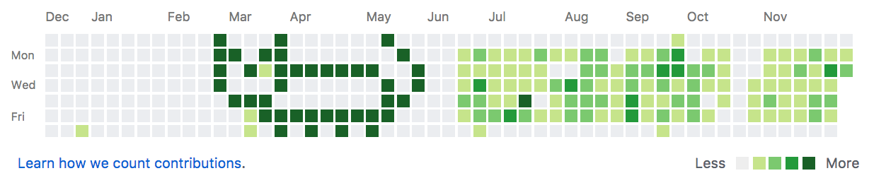

# GitHub history art

Paint some sweet art in your GitHub commit history.

## [Example](https://github.com/KATT)



## HOW?!? 😻

### Setup

* [Create a personal API token](https://github.com/settings/tokens) (with access to create/delete private repos)
* `npm i gitkatt -g`
* (Optional) Export env variables for the script to default to
  ```sh
  export GITHUB_USER='YOUR_GITHUB_USER'
  export GITHUB_API_TOKEN='YOUR_GITHUB_API_TOKEN'
  export DRAW_START_DATE='2017-02-26'
  export ART_FILENAME='art'
  ```
  `DRAW_START_DATE` is the top left corner of your painting (should be a Sunday, otherwise it'll get well weird)

### Run

Basically, the longer you let it run the darker your dots becomes. Every time you run it it will delete (clears the graph) and create a repo called `gitkatt-child-repo` ([Example repo](https://github.com/KATT/gitkatt-child-repo)).


```
gitkatt
```

A file called `./art` will be created automatically with a template.
  * any non-whitespace char gets filled
  * the canvas is 7 in height (7 days)